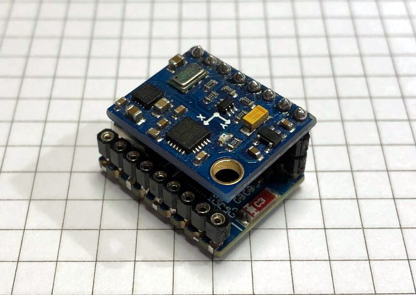

This repository contains AHRS example for [estima crate](https://github.com/copterust/estima/).
It was tested with GY-86 and [ESP32-C6-Zero](https://www.waveshare.com/wiki/ESP32-C6-Zero) boards.

  

Running at 160 MHz (no FPU), it achieves approximately 19 Hz sampling.
Connections are simple, just plug one PCB into another as on an image above.

| ESP32  | GY-86  |
|--------|--------|
| GPIO22 | VCC_IN |
| GPIO21 | 3.3V   |
| GPIO20 | GND    |
| GPIO18 | SDA    |
| GPIO19 | SCL    |

# Sensors
GY-86 board combines MPU6050, HMC5883L, and MS5611 on a single PCB board.

## HMC5883L Magnetometer

A magnetometer provides XYZ components of the magnetic field. Before using that
data we need to calibrate the sensor. In an ideal world all measurements would
be on a centered sphere, but in the real one we have soft and hard-iron biases.

Having a magnet around "pulls" measurements from the center, creating a hard
iron bias. A piece of magnetic material like iron would stretch or distort the
magnetic field.

We will use simple magnetometer model for calibration: h = A(h_m - b).
Calibration parameters A and b could be estimated by fitting an ellipsoid to
raw measurements and finding ones that turn distorted ellipsoid into perfect
sphere.

Parameters are stored in [MagCalibration](https://github.com/copterust/esp-ahrs-probe/blob/main/src/config.rs#L10-L21),
magnetic reference is stored in [AccelMagMeasurement](https://github.com/copterust/esp-ahrs-probe/blob/main/src/ahrs.rs#L61).

You need to adjust them for your location and sensor.
